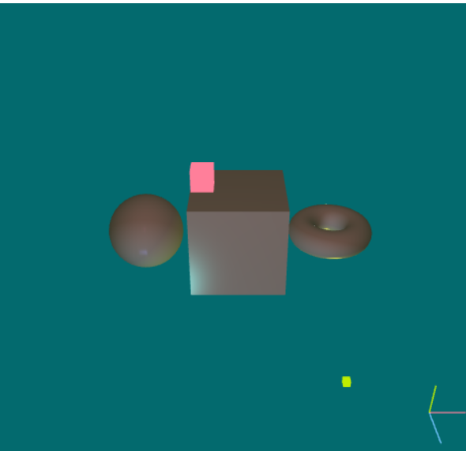
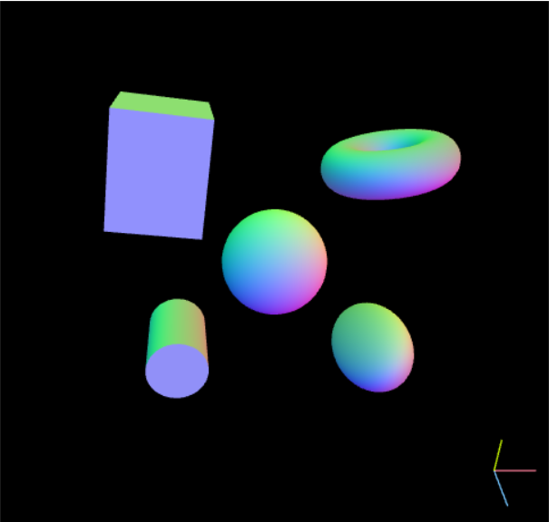
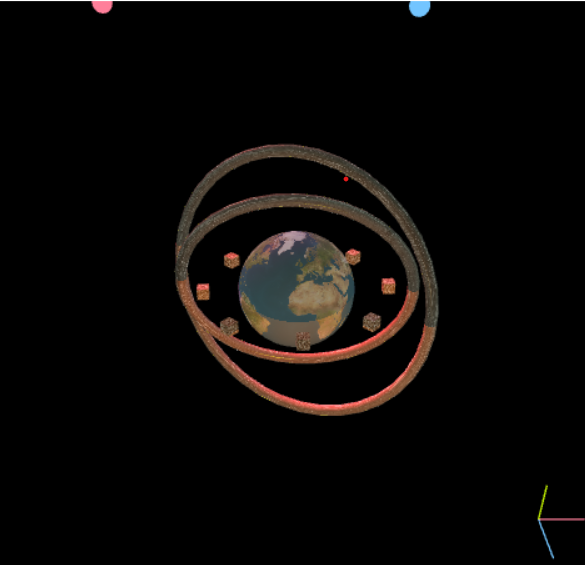

# PA4_FALL2024
# DisplayableCube
The DisplayableCube class is a representation of a 3D cube that can be rendered using OpenGL. It is designed to be used in a graphics application to display a cube with customizable size and color. The cube's geometry and rendering logic are handled using OpenGL buffers, such as Vertex Array Objects (VAO), Vertex Buffer Objects (VBO), and Element Buffer Objects (EBO).

Key Features:
OpenGL Buffers: The cube uses VAO, VBO, and EBO to store and manage its geometry and rendering data.

VAO: Stores the state of the vertex attribute pointers.
VBO: Contains the vertex data (positions, normals, colors, etc.).
EBO: Contains the indices that define the geometry.
Customizable Cube Dimensions and Color:

You can set the cube's dimensions (length, width, height) and its color (default color is blue).
Shader Program Integration: The class works with a shader program to render the cube. The shaderProg parameter is passed into the constructor and used to apply a shader when drawing the cube.

Vertices and Indices Generation:

The generate() function calculates the vertices of the cube based on the provided dimensions (length, width, height) and color.
The cube is created by defining vertices for each of its six faces (front, back, left, right, top, bottom). Each vertex stores the position, normal vector, color, and texture coordinates (the texture coordinates are set up but not yet used).
OpenGL Rendering:

In the initialize() function, the cube's vertex and element buffers are set up using VBO and EBO. The attribute pointers for position, normal, color, and texture are configured.
The draw() function binds the VAO, and calls the EBO to render the cube.

# DisplayableCylinder Class

The `DisplayableCylinder` class generates and renders a 3D cylinder using OpenGL. The class constructs the cylinder's geometry using **vertices** (positions, normals, colors, and texture coordinates) and **indices** (which define the triangle elements for rendering the cylinder's surface).

## Vertices Calculation

The cylinder is parameterized using cylindrical coordinates. The positions of the vertices are calculated based on the following formulas:

### Position

For each vertex, the position is calculated using the following formulas:

$$
x = \text{radiusX} \cdot \cos(\theta)
$$

$$
y = \text{radiusY} \cdot \sin(\theta)
$$

$$
z = \text{z-coordinate from stack level}
$$

Where:
- \( \theta \) is the angular position around the cylinder's axis, ranging from \( 0 \) to \( 2\pi \) (representing the circle's circumference).
- The \( z \)-coordinate varies along the height of the cylinder, defined by the **stack**.

### Normals (Side Surface)

Normals on the side surface are calculated using the direction of the radius in the \( xy \)-plane, with the following formulas:

$$
n_x = \cos(\theta)
$$

$$
n_y = \sin(\theta)
$$

$$
n_z = 0 \quad \text{(since the normal vector lies in the xy-plane for the sides)}
$$

### Texture Coordinates

The texture coordinates \( u \) and \( v \) are calculated based on the angular and vertical positions of the vertices:

$$
u = \frac{j}{\text{slices}}
$$

$$
v = \frac{i}{\text{stacks}}
$$

Where:
- \( u \) ranges from \( 0 \) to \( 1 \) based on the angular position.
- \( v \) ranges from \( 0 \) to \( 1 \) based on the height (stack level).

Thus, each vertex has 11 attributes:
1. **Position**: \( x, y, z \) (3 components)
2. **Normal**: \( n_x, n_y, n_z \) (3 components)
3. **Color**: \( r, g, b \) (3 components)
4. **Texture Coordinates**: \( u, v \) (2 components)

Each vertex is represented by an array of 11 elements:

## Indices Calculation

The **indices** define how the vertices are connected to form triangles for rendering the cylinder's side surface and caps (top and bottom).

### Side Surface Indices

For the side surface, we generate two triangles for each slice of the cylinder. The indices are calculated by looping over the stacks and slices. Each stack defines a ring around the cylinder, and each slice defines a segment around the ring.

For each pair of adjacent vertices (in the stack and slice directions), two triangles are formed to represent the surface between the two vertices:

- For a given \( i \)-th stack and \( j \)-th slice, the indices are calculated as follows:
  - **Current vertex**: \( \text{current} = i \cdot \text{slices} + j \)
  - **Next stack vertex**: \( \text{next\_stack} = (i + 1) \cdot \text{slices} + j \)
  - **Next slice vertex**: \( \text{next\_slice} = i \cdot \text{slices} + (j + 1) \% \text{slices} \)

These three vertices form one triangle, and the next set of three vertices (for the second triangle) is formed by connecting the **next stack** vertex, **next next stack** vertex, and **next slice** vertex.

### Top and Bottom Cap Indices

The top and bottom caps are formed by connecting the central vertices of the caps to the vertices of the outer rings. The central vertex is at the top and bottom faces of the cylinder:

- **Top center**: At \( z = +\text{radiusZ} \)
- **Bottom center**: At \( z = -\text{radiusZ} \)

The indices for the top and bottom caps are generated by connecting the central vertex to the outer vertices for each slice:
- For the top cap:
  - **Center**: \( \text{top\_center} \)
  - **Outer vertices**: The outer vertices of the top face (calculated using \( \theta \) values).
  - Each triangle is formed between the center vertex and two consecutive outer vertices.

- For the bottom cap:
  - **Center**: \( \text{bottom\_center} \)
  - **Outer vertices**: The outer vertices of the bottom face (calculated similarly to the top face).
  - Each triangle is formed between the center vertex and two consecutive outer vertices.

## Summary of the **11 Attributes per Vertex**

1. **Position**: \( x, y, z \) (3 components)
2. **Normal**: \( n_x, n_y, n_z \) (3 components)
3. **Color**: \( r, g, b \) (3 components)
4. **Texture Coordinates**: \( u, v \) (2 components)

Each vertex consists of **11** values in total.

# DisplayableEllipsoid
### Vertices Calculation

The vertices of the ellipsoid are generated using spherical coordinates, specifically the **spherical-to-cartesian conversion** formulas for each point on the surface. The formula for the position of each vertex on the ellipsoid is:

$$
x = a \cdot \cos(\theta) \cdot \sin(\phi)
$$

$$
y = b \cdot \cos(\phi)
$$

$$
z = c \cdot \sin(\theta) \cdot \sin(\phi)
$$

Where:
- \( a \), \( b \), and \( c \) are the radii of the ellipsoid along the X, Y, and Z axes, respectively.
- \( \theta \) is the azimuthal angle (in the xy-plane), ranging from \( 0 \) to \( 2\pi \) (full circle).
- \( \phi \) is the polar angle (from the z-axis), ranging from \( 0 \) to \( \pi \) (from the north pole to the south pole).

The **normals** at each vertex are calculated using the derivative of the position with respect to the ellipsoid’s parametric equations. The normal vector is then normalized to have unit length. The formulas for the normal vector components at each vertex are:

$$
n_x = \frac{2x}{a^2}
$$

$$
n_y = \frac{2y}{b^2}
$$

$$
n_z = \frac{2z}{c^2}
$$

Finally, the **texture coordinates** (\( u \), \( v \)) are computed based on the angular positions of the vertex:

$$
u = 1 - \frac{\theta}{2\pi}
$$

$$
v = \frac{| \phi - \pi |}{\pi}
$$

Where:
- \( u \) ranges from 0 to 1 as the angle \( \theta \) goes from 0 to \( 2\pi \).
- \( v \) ranges from 0 to 1 as \( \phi \) moves from 0 to \( \pi \).

### Indices Calculation

The indices define how the vertices are connected to form triangles that represent the surface of the ellipsoid. The ellipsoid is divided into **stacks** (horizontal bands of latitude) and **slices** (vertical segments of longitude). The indices are calculated by looping over the stacks and slices, forming two triangles for each segment between adjacent vertices.

- For each stack (except the first and last), and each slice (except the first and last), four vertices form a quadrilateral, which is then divided into two triangles. This is done by connecting the current vertex with its neighbors in both the slice and stack directions.
- The indices for the top and bottom caps of the ellipsoid (the poles) are handled separately. For the top cap, the center vertex is connected to the vertices of the uppermost stack, and similarly for the bottom cap.

# DisplayableTorus Class

The `DisplayableTorus` class generates and renders a 3D torus (donut-shaped surface) using OpenGL. The class constructs the torus geometry using **vertices** (positions, normals, colors, and texture coordinates) and **indices** (which define the triangle elements for rendering the torus).

## Vertices Calculation

The torus is parameterized using two angular variables:
1. \( \theta \) (the angle for the central ring of the torus).
2. \( \phi \) (the angle for the smaller cross-section of the torus).

Each vertex in the torus is located on the surface of the torus defined by the following formulas:

### Position

For each vertex, the position is calculated as follows:

$$
x = (\text{outerRadius} + \text{innerRadius} \cdot \sin(\phi)) \cdot \cos(\theta)
$$

$$
y = (\text{outerRadius} + \text{innerRadius} \cdot \sin(\phi)) \cdot \sin(\theta)
$$

$$
z = \text{innerRadius} \cdot \cos(\phi)
$$

Where:
- \( \theta \) is the angle for the central ring (ranging from \( 0 \) to \( 2\pi \)).
- \( \phi \) is the angle for the smaller cross-section (ranging from \( 0 \) to \( 2\pi \)).

### Normals

The normal vectors are calculated based on the parametric equations of the torus, which are derived from the derivative of the position. The components of the normal vector are given by:

$$
n_x = \sin(\phi) \cdot \cos(\theta)
$$

$$
n_y = \sin(\phi) \cdot \sin(\theta)
$$

$$
n_z = \cos(\phi)
$$

### Texture Coordinates

The texture coordinates \( u \) and \( v \) are calculated based on the angular positions of the vertices:

$$
u = \frac{i}{\text{rings} - 1}
$$

$$
v = \frac{j}{\text{nsides} - 1}
$$

Where:
- \( u \) ranges from \( 0 \) to \( 1 \) based on the \( \theta \)-angle (ring angle).
- \( v \) ranges from \( 0 \) to \( 1 \) based on the \( \phi \)-angle (cross-sectional angle).

Thus, each vertex has **11 attributes**:
1. **Position**: \( x, y, z \) (3 components)
2. **Normal**: \( n_x, n_y, n_z \) (3 components)
3. **Color**: \( r, g, b \) (3 components)
4. **Texture Coordinates**: \( u, v \) (2 components)

Each vertex is represented by an array of 11 values:

# Lighting
at GLProgramp.py define lighting formula
### Ambient Light

Ambient light represents the basic illumination present in a scene. It is the light that has been scattered in all directions and is not dependent on the surface orientation or the direction of the light source.

$$
\text{ambientColor} = \text{currentLight.color} \times \text{material.ambient}
$$

Where:
- `currentLight.color` is the color (or intensity) of the light source.
- `material.ambient` is the material's ambient reflection coefficient (how much ambient light it reflects).

**Principle**: Ambient light is added to ensure that objects are not completely dark when no direct light is hitting them. It helps simulate the light that has scattered around the environment.

---

### Diffuse Light

Diffuse light simulates the light that hits a surface and scatters in all directions. According to **Lambert's reflection model**, the intensity of diffuse reflection is proportional to the cosine of the angle between the surface normal (`vNormal`) and the light direction (`lightDir`).

$$
\text{diffuseColor} = \text{currentLight.color} \times \text{material.diffuse} \times \max(\text{dot}(vNormal, lightDir), 0.0)
$$

Where:
- `currentLight.color` is the color of the light source.
- `material.diffuse` is the material's diffuse reflection coefficient.
- `vNormal` is the surface normal vector (the direction perpendicular to the surface).
- `lightDir` is the normalized vector from the surface point to the light source.
- `dot(vNormal, lightDir)` calculates the dot product between the normal and the light direction vectors.

**Principle**: The `dot` product gives the cosine of the angle between the surface normal and the light direction. When the surface faces the light source (angle close to 0°), the dot product is high, leading to a strong diffuse reflection. When the surface is perpendicular to the light source (90°), the reflection is zero. `max(..., 0.0)` ensures that the result is never negative.

---

### Specular Light

Specular light simulates the light that is reflected off a surface in a mirror-like fashion. The intensity of the specular reflection depends on the angle between the view direction (`viewDir`) and the reflected light direction (`reflectDir`). The **Blinn-Phong reflection model** is often used for specular reflection.

$$
\text{specularColor} = \text{currentLight.color} \times \text{material.specular} \times \left( \max(\text{dot}(viewDir, reflectDir), 0.0) \right)^{\text{material.highlight}}
$$

Where:
- `currentLight.color` is the color of the light source.
- `material.specular` is the material's specular reflection coefficient.
- `viewDir` is the vector from the surface point to the viewer (or camera).
- `reflectDir` is the reflection direction, calculated as:
$$
  \text{reflectDir} = \text{reflect}(-\text{lightDir}, \text{vNormal})
$$
- `material.highlight` is the shininess coefficient that controls the sharpness of the specular highlight.

**Principle**:
- **Reflection direction**: `reflectDir` is calculated by reflecting the light direction vector around the surface normal (`vNormal`).
- **View direction**: `viewDir` is the vector from the surface point to the camera (or observer).
- **Specular intensity**: `dot(viewDir, reflectDir)` measures how aligned the view direction is with the reflection direction. If they are aligned, the result is close to 1, meaning a strong specular highlight. If they are not aligned, the result is close to 0.
- **Shininess**: The `pow(..., material.highlight)` term controls the sharpness of the specular reflection. A higher value for `highlight` makes the specular reflection more concentrated and sharper, while a lower value spreads the reflection over a wider area.

---

### Summary of the Components:
- **Ambient Light**: Provides a constant light level, simulating the overall lighting in a scene.
- **Diffuse Light**: Simulates light scattered in all directions, with intensity based on the angle between the light source and the surface normal.
- **Specular Light**: Simulates mirror-like reflection of light, with intensity based on the alignment between the view direction and the reflection direction.

# SceneOne
push t or T button

# SceneTwo

push c or C button
The code defines a 3D scene (SceneTwo) with multiple geometric objects, materials, and rotating lights. Here's an overview of the scene's entities and movements:

Entities in the Scene:
Geometric Objects:

Cube: A cube is placed at position (-1, 1, 0) with a material that has a specific ambient, diffuse, and specular reflection.
Torus: A torus (doughnut-shaped object) is positioned at (1, 1, 0), rotated by 90 degrees around its axis. It has its own material properties.
Sphere: A sphere (ellipsoid with equal radii) is located at (0, 0, 0) with material properties defined.
Cylinder: A cylinder is placed at (-1, -1, 0) with specified material properties.
Ellipsoid: Another ellipsoid (with different radii) is placed at (1, -1, 0) with its own material properties.
Lights:

Light Sources: Three lights are defined, each with a specific color:
Red Light: Light positioned at a radius of 3 units, initially at angle 0.
Blue Light: Light positioned at the same radius, but with a different angle (60 degrees).
Green Light: Another light positioned at the same radius, but at an angle of 120 degrees.
Each light is represented as a small cube to visualize its position, with colors corresponding to the lights (SOFTRED, SOFTBLUE, SOFTGREEN).
Movements in the Scene:
Rotating Lights:

Each of the three light sources rotates around the origin in the 3D space. The rotation speeds are set at different rates for each light:
The red light rotates at 0.5 degrees per update.
The blue light rotates at 0.7 degrees per update.
The green light rotates at 1.0 degree per update.
This rotation is controlled by the lightPos function, which calculates the new position of each light based on a radius and angle.
Object Rotation:

In addition to the rotating lights, all the geometric objects (cube, torus, sphere, cylinder, and ellipsoid) are also animated with a fixed rotational speed in their respective axes:
All objects rotate with a speed of 1 degree per update along each axis (X, Y, Z).
The animationUpdate method updates these rotations, making the objects spin continuously.
Light Position Update:

The light positions are updated based on the rotation, and the shader program is updated to reflect the new positions of the lights. The shaderProg.setLight(i, v) function assigns the new light positions to the shader.
## switch light
push 0~9 to toggle on/off lightings
# SceneThree

push e or E button
The SceneThree class defines a dynamic 3D scene with rotating objects, lights, and textures. Here's an overview of the entities and movements:

Entities in the Scene:
Geometric Objects:

Cubes: Eight cubes are placed in a circle, each with a radius of 0.8. They are positioned based on an angular increment (equal spacing in a full circle) around the origin. Each cube has a material with specific reflection properties and a texture (stoneWall.jpg). The cubes rotate around their vertical axis.
Torus: A torus with a radius of 1.0 and inner radius 0.05 is placed at the origin. It has a marble texture (marble.jpg) and is rotated around its u-axis by 60 degrees.
Torus2: Another torus with a similar shape but a slightly larger radius (1.2). This torus is rotated by 90 degrees around the u-axis and 30 degrees around the v-axis. It also uses the marble texture.
Sphere: A sphere (ellipsoid) with equal radii of 0.5 is positioned at the origin and has a texture (earth.jpg). It rotates continuously on the v-axis.
Lights:

Red Light: Positioned using spherical coordinates and transformed by a matrix. It has an infinite light direction, and a small red ellipsoid visualizes the light source.
Blue Light: Similar to the red light, but with a different color and no infinite direction (localized light).
Green Light: This light has a spotlight effect with a defined direction ([0.0, -1.0, 0.0]), a radial factor, and an angle limit of 30 degrees.
Movements in the Scene:
Rotating Lights:

The three light sources (red, blue, green) rotate around the scene in spherical coordinates. The angles are updated in each frame (0.5, 0.7, and 1.0 degrees for each light respectively). The green light has additional spotlight attributes.
The light sources are visualized as small ellipsoids (lightCube0, lightCube1, and lightCube2).
Object Rotation:

Cubes: The cubes rotate around the center of the circle they form, with their angular position updated based on the current rotation angle (vAngle). They follow a circular path on the x-z plane.
Torus: The first torus (torus) rotates with a speed of 0.3, 0.4, and 0.5 degrees on the u, v, and w axes respectively. The second torus (torus2) has a different rotation speed (-0.6, -0.4, and 0.2 degrees).
Sphere: The sphere rotates continuously around its v-axis at 1 degree per frame.
Texture Mapping:

Each object has a texture applied, such as stoneWall.jpg for the cubes, marble.jpg for the tori, and earth.jpg for the sphere. The texture is updated in the rendering pipeline to give the scene a more realistic appearance.
Scene Initialization: